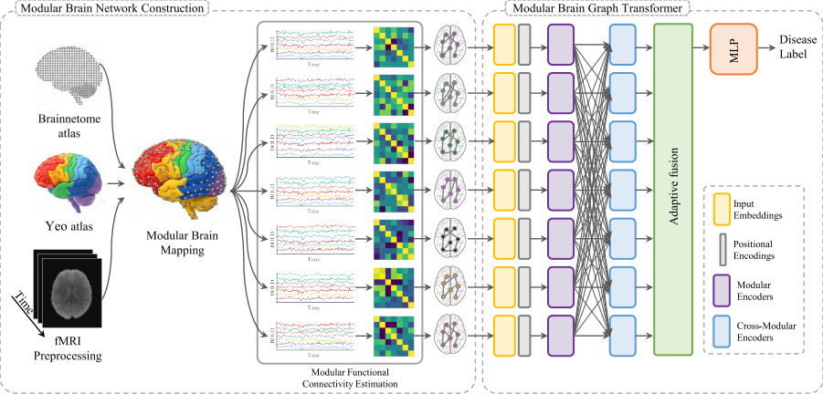

# mBrainGT: Modular Brain Graph Transformer for Brain Disorder Diagnosis

## Abstract
Functional brain networks play an essential role} in the diagnosis of brain disorders by enabling the identification of abnormal patterns and connections in brain activities. Many existing methods rely on whole-brain functional connectivity constructed from Functional Magnetic Resonance Imaging (fMRI) data, which can introduce noise and obscure localized disruptions. Subnetwork-based approaches have been explored to mitigate these issues by focusing on functionally meaningful brain subnetworks; however, such methods often encode subnetworks independently and rely on shallow or late fusion, limiting their ability to capture disrupted inter-subnetwork communication critical to disease pathology. To address this limitation, we propose mBrainGT, a modular brain graph transformer model that focuses on modular functional connectivity (mFC) for brain disorder diagnosis. Rather than using subnetworks alone, mBrainGT explicitly models both intra-subnetwork patterns and inter-subnetwork interactions through a combination of self-attention and cross-attention mechanisms, and integrates global information via adaptive fusion. We validate mBrainGT on three benchmark datasets (ADNI, PPMI, and ABIDE). Experimental results demonstrate that mBrainGT achieves improved diagnostic accuracy compared to existing methods, providing more robust and precise brain network representations for disease detection. These findings highlight the potential of interaction-aware modular graph learning to refine brain disorder diagnostics and offer biologically meaningful representations of functional brain networks.




## Datasets

- **ADNI (Alzheimer’s Disease Neuroimaging Initiative)**: https://adni.loni.usc.edu/
- **PPMI (Parkinson’s Progression Markers Initiative)**: https://www.ppmi-info.org/
- **ABIDE (Autism Brain Imaging Data Exchange)**: http://fcon_1000.projects.nitrc.org/indi/abide/

> Note: ADNI and PPMI require registration and data use agreements.

## Requirements
### System Tools
- Python **3.10+**
- (Recommended) CUDA-enabled GPU for training

### Python Libraries
- torch (PyTorch 2.x)
- numpy, scipy, pandas
- scikit-learn
- pyyaml
- networkx
- neuroHarmonize (ComBat)
- nibabel, nilearn (atlas handling and time-series extraction)
- (Optional full fMRI preprocessing) nipype, FSL, SPM

Install:
```bash
pip install -r requirements.txt
```

## How to Run
### 1) Prepare inputs
- Put dataset metadata at `data/raw/participants.tsv` (must include `subject_id`, `y`, `site_id`, and any covariates you want for ComBat such as `age`, `sex`, `mean_fd`).
- Provide (or generate) preprocessed fMRI NIfTI paths per subject in `data/derived/preproc/manifest.csv`.

### 2) Modular Brain Mapping (Module 2)
Generates ROI-to-module assignments and ROI MNI coordinates.
```bash
python scripts/Modular_Brain_Mapping.py --config configs/default.yaml
```

### 3) Modular Functional Connectivity Estimation (Module 3)
Computes modular FC (intra-module), p-values (approx), global FC, and centralities.
```bash
python scripts/Modular_Functional_Connectivity_Estimation.py --config configs/default.yaml
```

### 4) Build fold packages (Module 4)
Applies fold-safe ComBat and writes model-ready `.pt` packages.
```bash
python scripts/modular-brain-network-construction.py --config configs/default.yaml --metadata data/raw/participants.tsv
```

### 5) Train (Module 11)
```bash
python scripts/training.py --config configs/default.yaml --experiment mBrainGT_cv1 --fold -1 --device cuda
```

### 6) Inference & evaluation (Module 12)
```bash
python scripts/inference.py --config configs/default.yaml --ckpt data/derived/runs/mBrainGT_cv1/fold_0/best.pt --split_dir data/derived/fold_packages/fold_0/test --out_dir data/derived/runs/mBrainGT_cv1/fold_0/inference_test --device cuda --amp
```

### 7) AUC paired t-tests + BH-FDR (q=0.05)
```bash
python scripts/inference.py --config configs/default.yaml --auc_stats_out data/derived/runs/auc_stats.json --primary_method mBrainGT --method mBrainGT=data/derived/runs/mBrainGT_cv1 --method Baseline=data/derived/runs/baseline_cv1 --fdr_q 0.05
```

## Citation
If you use this code in your research, please cite:
```bibtex
@article{mBrainGT,
  title={mBrainGT: Modular Graph Transformer for Brain Disorder Diagnosis},
  author={...},
  journal={...},
  year={...}
}
```
Replace `author/journal/year` with final publication metadata (or your preprint).


